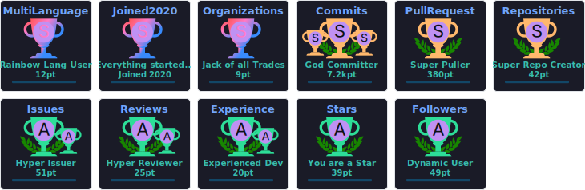

<!-- ───────────────────────── HEADER ───────────────────────── -->

<!-- typing subtitle -->

  
  

<!-- ───────────────────────── PROJECTS ───────────────────────── -->

## 🚀 부트캠프 및 사이드프로젝트

<table>
  <tr>
    <td width="50%" valign="top">
      <h3>🏆 카카오 테크캠퍼스 (최우수상)</h3>
      <ul>
        <li>사이트 : <a href="https://pull.it.kr">https://pull.it.kr</a></li>
        <li>깃허브 : <a href="https://github.com/orgs/kakao-tech-campus-3rd-step3/teams/team2/repositories">team2 repositories</a></li>
        <li>협업 공간 : <a href="https://www.notion.so/2-245c61d733498000a869fc6fb977d52e">Notion</a></li>
      </ul>
    </td>
    <td width="50%" valign="top">
      <h3>💡 제로투원</h3>
      <ul>
        <li>사이트 : <a href="https://zeroone.it.kr">https://zeroone.it.kr</a></li>
        <li>깃허브 : 프라이빗</li>
        <li>협업 공간 : 프라이빗</li>
      </ul>
    </td>
  </tr>
</table>

<!-- ───────────────────────── TECH STACK ───────────────────────── -->

## 🛠️ Tech Stack

### My Core Tech

  
  
  
   
  
  
  
   
  
  

### I can Also deal with

<b>Data / Persistence</b>

  
  
  
  

<b>Infra / DevOps</b>

  
  
  
  
  

<b>Web</b>

  
  

<b>Legacy</b>

  
  
  
  
  
  

<!-- ───────────────────────── GITHUB STATS ───────────────────────── -->

## 📊 GitHub Stats

  
  

## 🧩 Coding Activity

  
  

## 🏆 Trophy

<!-- self-hosted static SVG, generated daily by .github/workflows/trophy.yml -->

## 🎢 Contribution

