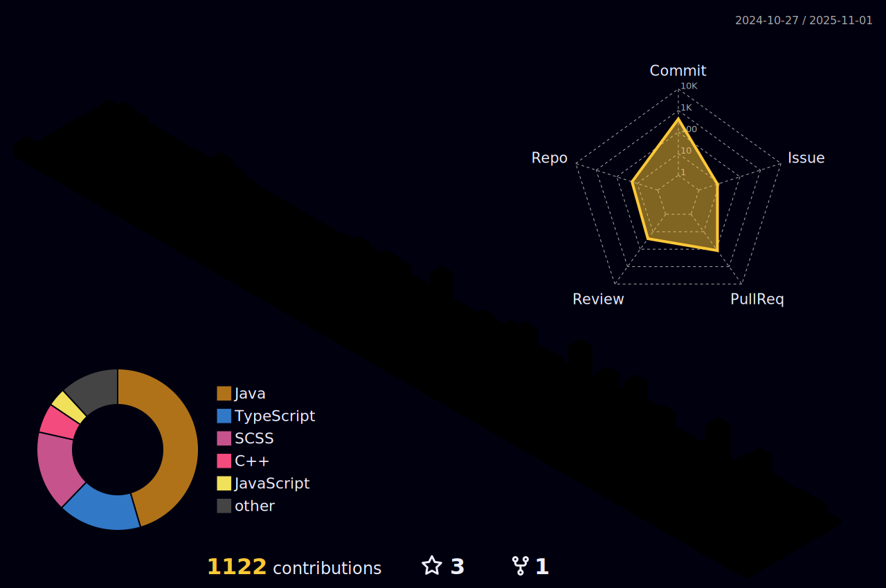

  
# 😎 안녕하세요 (Hello!)
  
 아니?! 오늘 할 거 뒤지게 많잖아? 개꿀잼인 걸? 
 오늘 무슨 일이 있어도 다 해내자. 오늘을 최고의 하루로 살아겠다는 다짐으로 해내자. 
<a href="https://osumaniaddict527.tistory.com/">https://osumaniaddict527.tistory.com/</a> 
<a href="https://hyeonjun0527.github.io/">https://hyeonjun0527.github.io/</a>

  
  

## 부트캠프 및 사이드프로젝트

**카카오 테크캠퍼스** 
사이트 : <a href="https://pull.it.kr"/>https://pull.it.kr</a> 
깃허브 : <a href="https://github.com/orgs/kakao-tech-campus-3rd-step3/teams/team2/repositories"/>https://github.com/orgs/kakao-tech-campus-3rd-step3/teams/team2/repositories</a> 
협업 공간 : <a href="https://www.notion.so/2-245c61d733498000a869fc6fb977d52e"/>https://www.notion.so/2-245c61d733498000a869fc6fb977d52e</a> 

**제로투원** 
사이트 : <a href="https://zeroone.it.kr"/>https://zeroone.it.kr</a> 
깃허브 : 프라이빗 
협업 공간 : 프라이빗 

### My Core Tech

  
  
  
   
  
  
  
   
  
  

### I can Also deal with
<table>
  <tr>
    <td width="50%" valign="center" align="center">
      <strong>Data / Persistence</strong> 
      

        
        
        
        
      

      <strong>Infra / DevOps</strong> 
      

        
        
        
        
        
      

      <strong>Web</strong> 
      

        
        
      

      <strong>Legacy</strong> 
      

        
        
        
        
        
        
      

    </td>
    <td width="50%" valign="center" align="center">
      <strong>Data Structure & Algorithm</strong>   
      
    </td>
  </tr>
</table>

### 하루를 전부 기록하기(4개월차)

https://docs.google.com/spreadsheets/d/1qpeoRUZG-D7lVs9OQ_MtA80a2JH8O0vuFLCE_VkvpbI/edit?usp=sharing

